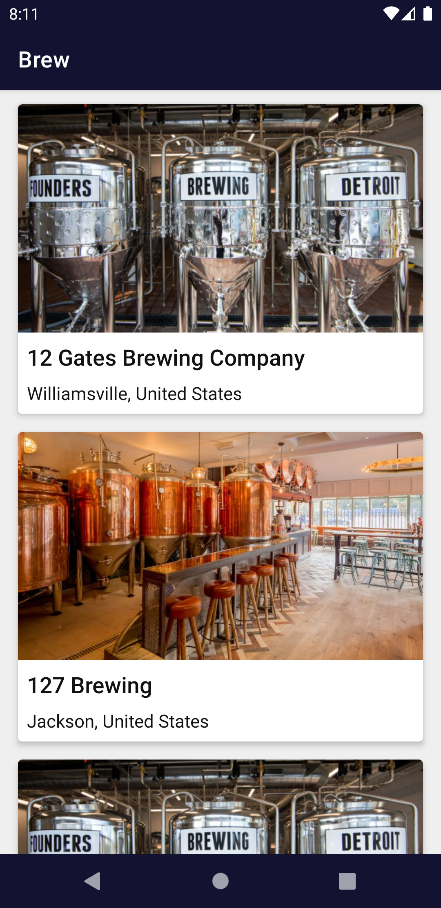
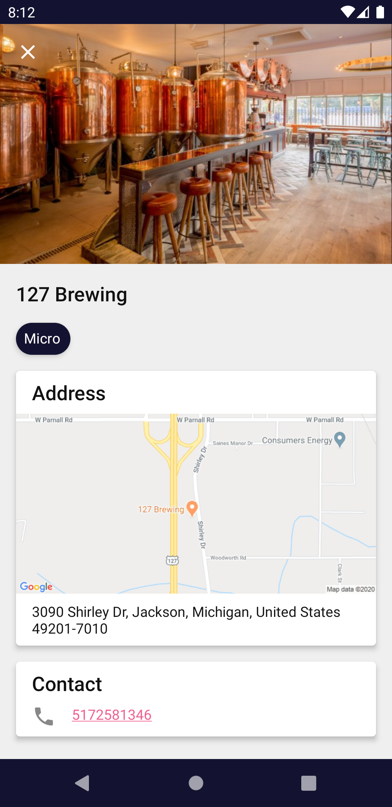
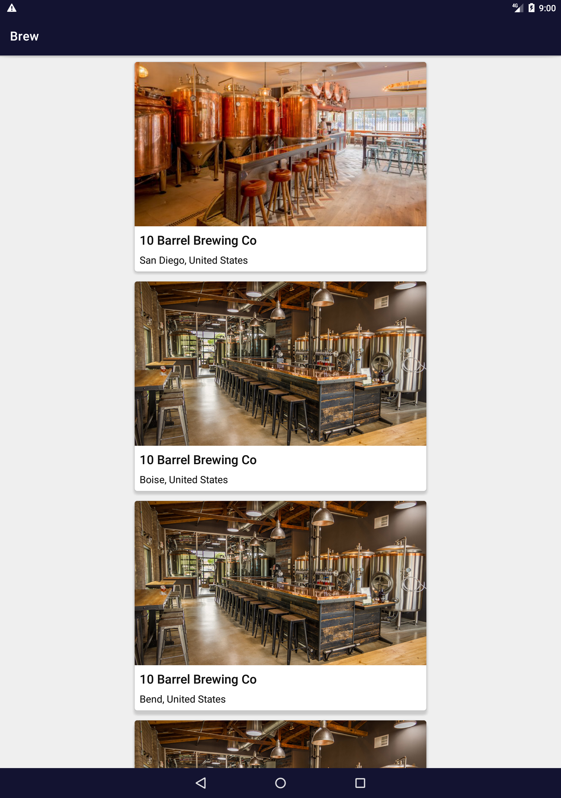
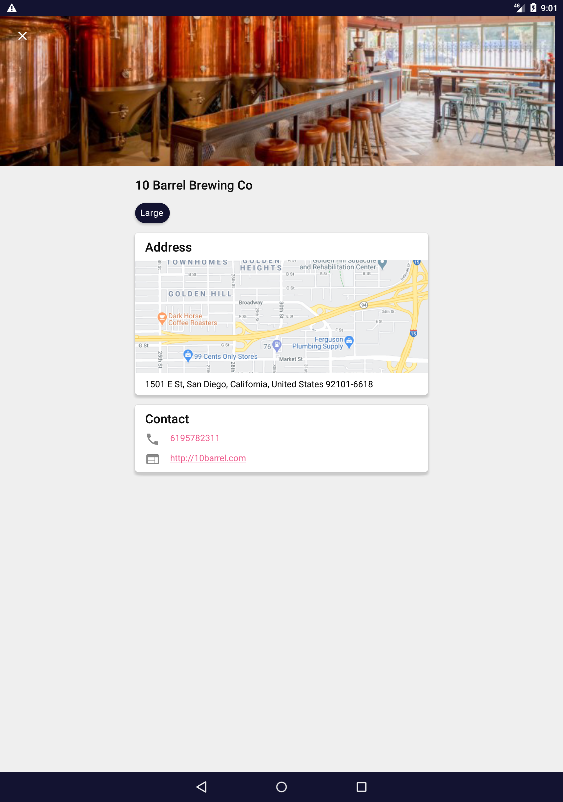

[](https://android-arsenal.com/api?level=21)  

# Brew - Brewery Database App

This project is to demonstrate the MVVM architecture with paging3 library and offline caching using database. 
This android application lists the breweries list. When tap on any brewery it will open the brewery detail with it's name, image, address, phone, web url and other attributes.

### Highlights:
- Follows **MVVM architecture pattern**.Uses android architecture components such as LiveData and ViewModel. 
- Uses **Paging3** library to show the paged list of breweries.
- **Offline first** approach. 
  - All the brewery list pages loaded from network are cached in the database which acts as SSOT. 
  - Once all the pages are displayed from the database, [RemoteMediator](https://developer.android.com/reference/kotlin/androidx/paging/RemoteMediator) will load the next page from network and cache it. 
  - User can invalidate cache anytime by just doing simple swipe refresh.  
- Uses **dagger2** for dependency injection. 
  - This is to provide clear separation between different architecture layers. 
  - Helps to write testable code by swapping dependency module in android tests.
- Single activity application.
- Uses retrofit as networking client.
- shared element transition between list and detail page of the app.

### Screenshots:

| | List | Detail |
|----|----|----|
| Phone - Portrait |  |  | 
| Tablet - Portrait |  |  | 

### API

- This app user APIs from the [OpenBreweryDb](https://www.openbrewerydb.org/) to list the breweries in a paginated list.
- **API Doc:** [List Breweries](https://www.openbrewerydb.org/documentation/01-listbreweries)
- **Sample Response:**

```json
[
  {
    "id": 299,
    "name": "Almanac Beer Company",
    "brewery_type": "micro",
    "street": "651B W Tower Ave",
    "city": "Alameda",
    "state": "California",
    "postal_code": "94501-5047",
    "country": "United States",
    "longitude": "-122.306283180899",
    "latitude": "37.7834497667258",
    "phone": "4159326531",
    "website_url": "http://almanacbeer.com",
    "updated_at": "2018-08-23T23:24:11.758Z",
    "tag_list": []
  }
]
``` 

### Requirement: 

- [Android Studio](https://developer.android.com/studio)
- [Maps Static API](https://developers.google.com/maps/documentation/maps-static/overview) key to display the google maps image in brewery detail page. Get an API key by following [these](https://developers.google.com/maps/documentation/maps-static/get-api-key) steps and put it into your `local.properties` like below:
```properties
googleApiKey=<your key here>
```

### Test:

- This app contains [Unit tests](app/src/test/java/com/kevalpatel2106/brew) and sample [UI test](app/src/androidTest/java/com/kevalpatel2106/brew).
- To run tests,
  1. Connect physical device.
  2. Run following command:
 ```shell script
./gradlew cAT
./gradlew test
```

## Want to contribute?
Every small or large contribution to this project is appreciated. Make sure you read the [contribution guide](/.github/CONTRIBUTING.md) before generating the pull request.

## Questions?🤔
Hit me on twitter [](https://twitter.com/chaytanyasinha?s=08)

<div align="center">

</div>
